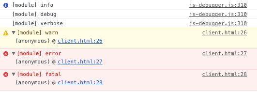
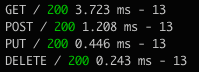
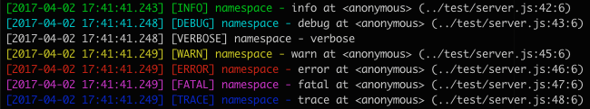

# JSdebugger

> A suite of tools to debug your JavaScript in the browser and in Node.

## Overview

**JSdebugger** uses [morgan](https://github.com/expressjs/morgan) to log HTTP requests, [log4js-node](https://github.com/nomiddlename/log4js-node) for node and [js-logger](https://github.com/jonnyreeves/js-logger) for the browser.

Wraps **js-logger** and **log4js-node** with a unique API and some default values.

## Install

```bash
npm install js-debugger
```

## How it works

### browser

###### Options

Name | Type | Default | Description
---- | ---- | ----    | ----
disabled | `Boolean` | **false** | If set to **true** disable all logs.
globalDebug | `string ` | **false** | A name for the global debug variable.
globalConsole | `string` | **false** | A name for the global console variable.
level | `string` | **'error'** | Default maximun level.

#### Exemple

```js
import jsdebugger from 'js-debugger';
const debug = jsdebugger(options);

const _log = debug('module').level('debug');

_log.info('info');
_log.debug('debug');
_log.verbose('verbose');
_log.warn('warn');
_log.error('error');
_log.fatal('fatal');
_log.trace('trace');
```



### Node

You can use all the options from the browser plus this ones:

###### Options

Name | Type | Default | Description
---- | ---- | ----    | ----
line | `Boolean` `Object` | **false** | Display line numbe, see [line](#line).
morgan | `Object` | **undefined** | Options for morgan, see [morgan](#morgan).
notify | `Object` | **undefined** | Options for notify, see [notify](#notify).

##### line

Enable line number, thanks to [log4js-node-extend](https://github.com/ww24/log4js-node-extend).

```js
line: true;

// or

line: {
  path: __dirname,
  format: 'at @name (@file:@line:@column)'
};
```


##### morgan

Enable **morgan** with express, please check the [API](https://github.com/expressjs/morgan#api).

```js
morgan: {
  app: app, // The express app object.
  format: 'dev', // morgan format.
  opts: {}, // morgan options.
};
```


##### notify

Enable notifications by email, please check the [API](https://github.com/nomiddlename/log4js-node/wiki/SMTP).

```js
morgan: {
  smtp: Object, // The SMTP object.
  email: {
    from: string,
    to: string,
    subject: string
  }
};
```

#### Exemple

```js
const jsdebugger = require('js-debugger');
const debug = jsdebugger(options);

const _log = debug('module').level('debug');

_log.info('info');
_log.debug('debug');
_log.verbose('verbose');
_log.warn('warn');
_log.error('error');
_log.fatal('fatal');
_log.trace('trace');
```


Contributing
----

**Test**

The unit test are written in Mocha.
Please add a unit test for every new feature or bug fix. ```npm test``` will run the tests.

**Documentation**

Please read and add documentation for every API change.

Feel free to contribute!

License
----

Copyright (c) 2017 Bruno Santos Licensed under the MIT license.
